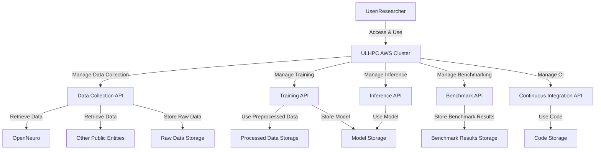

# Design Document: Pre-trained Model of Multi-Modal Resting State

This document outlines the design and development approach for building a multi-modal model for resting-state brain imaging while leveraging the ULHPC AWS cluster. It highlights the project's scope, goals, non-goals, design considerations, and key components.

## Context and scope

The project is at early stages of prototyping and its scope is not yet fully defined. But at this stage we aim to harness the capabilities of the ULHPC AWS cluster (i.e., Graviton3 aarch64 architecture) for the development, testing, and benchmarking large deep learning models tailored for research in neuroscience. The Graviton architecture provides a cost-effective environment for accessing the data, developing and training the models, and running the inference. The following are some of the key steps:

- Development environment setup
- Continuous integration and deployment
- Data collection and storage
- Preprocessing multi-modal resting-state datasets
- Model training and benchmarking

## Goals and non-goals

- Development: Set up a Graviton3-based cluster environment tailored for neuroscience and deep learning toolkits. This includes selecting the most appropriate software stack for the cluster, installing and configuring the software, ensuring compatibility with the Aarch64 architecture, and providing an interactive interface to develop and test pipelines and models.

- Data Collection: Efficiently access publicly accessible data from OpenNeuro and similar platforms.
- Software Integration: Ensure compatibility and seamless operation of neuroscience software on the cluster.
- Validation: Verify individual stages of the data processing pipeline on the cluster.
- Benchmarking: Conduct mini-benchmarks on the cluster, limited to the application-level tools.
- Demonstrations: Showcase the cluster's utility for neuroscience, ML/DL pipelines, training, and inference.
- Continuous Integration: Implement and run CI processes on the cluster to ensure reproducibility.
- Licensing and Intellectual Property: Clarify any licensing terms related to the software, especially if it's going to be open-sourced. Also, address any intellectual property concerns.
- Cost Analysis: Provide a breakdown of  the expected costs associated with the project. This can include development costs, operational costs, and any other associated expenses.

Non-goals include:

- Comprehensive training and deployment of the full MultiModalRest model.
- Execution of the complete pipeline on the cluster.
- Commitment to a single software stack or pipeline (.e.g, fMRIPrep or MNE).
- Conducting exhaustive benchmarks on the cluster (including tools that are not directly related to deep learning or neuroscience, e.g., NumPy).
- Full training of the ML/DL pipeline on the cluster.
- A complete data collection from OpenNeuro or other sources, and gathering and processing private datasets.
- Defining and deploying an exhaustive list of CI tasks.
- Time-consuming preprocessing pipelines (e.g., default fMRIPrep pipeline).

## Design Choices

Emphasizing adaptability, the design is modular, allowing researchers to effortlessly incorporate new data sources, modify pipeline stages, or try ML/DL architectures. The design also prioritizes flexibility, ensuring that the pipeline can be easily adapted to different research needs. The following are some of the key design choices:

### Trade-offs

- Flexibility vs. Performance: A flexible approach is chosen over one that is commonly used in the literature or on that may offer higher performance. While a more rigid software stack could offer performance gains, we are opting for flexibility. This means, while we might not achieve the highest performance in some cases, we ensure our pipeline remains adaptable to different research needs. This includes, for example, preprocessing pipeline, for which, we are not using a single software stack that is optmized for x86 architecture (e.g., fMRIPrep) but rather a combination of tools (e.g., ANTs, MNE, Nilearn, etc.).

- Data Collection Choices: Prioritizing storage and computation resources, not all available data from OpenNeuro will be used. While we will be harnessing data from OpenNeuro, we are consciously avoiding collecting all available data. This is a trade-off between available resources (like storage and compute) and the comprehensiveness of our model. This also implies that instead of downloading full BIDS datasets, we selectively download only the necessary resting-state images, and prefer images that are already preprocessed to raw images.

- Brain Imaging Modalities: By using fMRI and M/EEG data, we are skip other modalities like PET for resource efficiency. This is a trade-off between available resources and the comprehensiveness of our model.

- Preprocessing & Training: Limited preprocessing steps and demonstrative training ensure optimal resource utilization. While we will be using some preprocessing steps, we are not using all the preprocessing steps or complete tools like fMRIPrep. This is agin a trade-off between available resources and the comprehensiveness of our model.

ML/DL Training: Rather than fully training on the cluster, we will only demonstrate training. This ensures that we don't exhaust cluster resources.

## System-context-diagram

## APIs

- Data Collection API: Facilitates data retrieval from OpenNeuro and other public entities.
- Training API: Manages and monitors ML/DL model training.
- Inference API: Enables loading of pre-trained models for predictions/inference.
- Benchmark API: Oversees benchmark executions and results retrieval.
- Continuous Integration API: Handles CI tasks and results collection.

## Data storages

- Code Storage: Centralized storage for code and scripts with CI integration. The CI integration ensures that the deployed is always up-to-date and the latest version is used. Currently, we use GitHub and GitHub Actions.
- Raw Data Storage: A dedicated storage for unprocessed data collected from public sources. Currently, we use `<project_root>/data/raw/` on the cluster disk. The files are stored in the BIDS format.
- Processed Data Storage: Houses preprocessed data. Currently, we use `<project_root>/data/processed/` on the cluster disk.
- Model Storage: To store checkpoints and trained models. Currently, we use `<project_root>/models/` on the cluster disk.
- Output Storage: For storing plots, reports, and logs. Currently, we use `<project_root>/outputs/` on the cluster disk.
- Benchmark Results Storage: For benchmark outcomes. Currently, we use `<project_root>/benchmarks/` on the cluster disk.

## TODO: Psuedo code

- Remote development environment

- Data collection

- Data preprocessing

- Model training

- Model inference

- Benchmarking

- Continuous integration

## Alternatives considered

Frameworks: BIDS, fMRIPrep, DataLad, Docker, OpenNeuro via DataLad, OpenNeuro via AWS-CLI
Preprocessing: fMRIPrep via DataLad, ANTs, custom codes, DeepLearing preprocessing
Platforms: ULHPC clusters (aion and iris), local computer, Cuda-based GPU instances
Data Sources: While OpenNeuro is a primary choice, alternative databases with neuroscience data could offer diverse datasets (e.g., openfmri). Here, we only used OpenNeuro.

## Open questions

- Is there any need for real-time data processing or inference?
- How to handle long-running tasks?
- Custom packages
- Compiler choices
- Remote development environment
- x86 vs. aarch64
- Are there predetermined performance benchmarks for model accuracy or processing speed?

## Cross-cutting concerns

- Security: We need to ensure that data access and storage comply with industry standards. Secure access control, and encryption mechanisms should be in place. This is also important when dealing with shared keys and credentials on GitHub.

- Privacy: As we are dealing with medical data, even though it's from public sources, strict privacy controls should be maintained to prevent any unintended data leaks.

- Observability: Logging, monitoring, and tracing mechanisms should be integrated to provide clear visibility into system operations, model performances, and any potential anomalies or issues.

- Scalability: The system should be capable of handling increased data volumes or user demand. Consider both vertical and horizontal scalability strategies and evaluate whether the system should automatically scale based on demand.

- Maintainability: Ensure that the software can be easily updated and modified. This includes creating modular code, having adequate documentation, and following coding best practices.

Resilience: The system should be able to recover quickly from failures. Consider failover mechanisms, backup strategies, and error handling to ensure uninterrupted service.

Usability: Prioritize user experience. This may involve creating intuitive user interfaces, providing comprehensive user documentation, and ensuring accessibility features.

Interoperability: Ensure that the system can work cohesively with other software systems, especially if integrating with third-party tools or platforms.

Backup and Recovery: Regularly back up data and establish a clear procedure for data recovery in case of failures.

Latency: Minimize the delay between user requests and system responses. Consider optimizing data retrieval methods, computations, and resource allocations.

Compliance: Ensure the system adheres to relevant industry regulations, especially when dealing with sensitive data like medical records.

Auditability: Implement logging mechanisms to track and record user activities and system operations, crucial for troubleshooting and ensuring data integrity.

Configurability: Allow system settings and parameters to be easily configured without altering the base code, providing flexibility to meet varying requirements.

Internationalization and Localization: If the software has a global audience, ensure it supports multiple languages, currencies, and regional formats.

Cost Efficiency: Monitor resource usage to optimize costs, especially if using cloud platforms that bill based on usage.

Portability: Ensure the software can be easily moved from one environment or platform to another.

## Bill of materials

A list of software packages to be installed on the machine, provided via the `environment.yml` file that can be installed using Micromamba:

### General
- Spack
- Mamba (via Module)
- Python (v3.11)
- Git
- Git LFS
- NodeJS/NPM
- Jupyter Notebook, ipykernel
- flake8
- Seaborn, Matplotlib

### Data
- AWSCLI
- Boto3
- GitAnnex
- DataLad
- OpenNeuro CLI
- AWS CLI
- DVC
- SafeTensor
- XArray, h5netcdf
- PyYAML

### Neuroimaging
- MNE
- fMRIPrep
- Nilearn

### ML/DL
- PyTorch (v2)
- PyTorch Lightning (v2)
- TensorBoard
- torchmetrics
- scikit-learn

### DevOps
- Docker
- Singularity
- Apptainer

# TODO:

Some potential additions and highlights:

Project Timeline and Milestones: it might be helpful to add a project timeline, defining key milestones and expected completion dates.

Stakeholders and Roles: Clearly defining the project stakeholders and their respective roles/responsibilities can help in streamlining the communication and task delegation process.

Technical Architecture: a more detailed technical architecture diagram to understand the interconnections and dependencies between different modules and components.

Dependencies: List out any third-party services or platforms that the project is dependent on. This could include data sources, libraries, or any external APIs.

Testing Strategy: This can include unit testing, integration testing, and user acceptance testing. Mention tools, frameworks, and methodologies that will be used.

Version Control and Documentation: Detail out the approach towards version control (branching strategy, merge requests, code reviews) and maintaining up-to-date documentation.

Error Handling and Troubleshooting: Outline the strategy for error handling within the software. This could include error logging, alerting mechanisms, and troubleshooting guides.

Resource Allocation: details on the resources allocated for the project, including hardware, software, and human resources.

Feedback Mechanism: how feedback from the users will be collected and incorporated into future iterations or versions of the software.

Data Retention and Archival: Detail the policies regarding data retention, backup, and archival. Mention how long the data will be stored, how often backups will be taken, and the process for data retrieval from backups.

Security Protocols: Expand on the security section by detailing any encryption methods, firewall configurations, and other security protocols that will be in place.

Performance Metrics: the metrics that will be used to gauge the performance of the model and the system as a whole. This could include accuracy, speed, resource utilization, etc.

User Interface (UI) and User Experience (UX) Design: provide mockups, wireframes, or descriptions of the UI/UX design.
